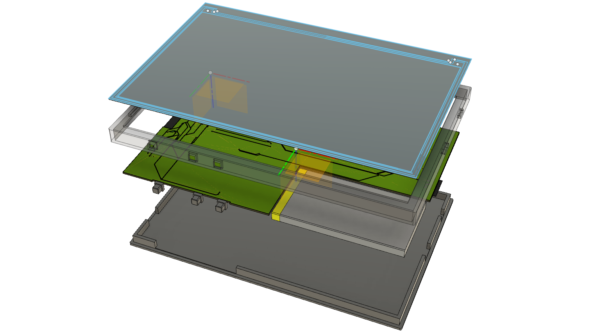

# OPEN BOOK
## Proiect TSC: Dezvoltarea unui e-book reader ieftin și open source

## **Diagrama bloc**

## Lista componentelor necesare (BOM)

| Device                       | Value              | Qty | Detailed Description                                                                              | Link                                                                                                                                                                                                                                                                                          | Datasheet                                                                                                                             |
|------------------------------|--------------------|-----|---------------------------------------------------------------------------------------------------|----------------------------|--------------------------------------|
| BUTTON_CUSYOMV1              |                    | 3   |                                                                                                   | https://mou.sr/41Yc6zX                                                                                                                                                                                                                                                                        | https://4donline.ihs.com/images/VipMasterIC/IC/PANA/PANA-S-A0000771493/PANA-S-A0000771493-1.pdf?hkey=CECEF36DEECDED6468708AAF2E19C0C6 |
| EAGLE-LTSPICE_CC0402         | 100nF              | 8   | CAPACITOR, European symbol                                                                        | https://mou.sr/4ctRJyb                                                                                                                                                                                                                                                                        | https://ro.mouser.com/datasheet/2/396/mlcc06_hq_AUTO_e-1901145.pdf                                                                    |
| EAGLE-LTSPICE_CC0402         | 4.7uF              | 5   | CAPACITOR, European symbol                                                                        | https://mou.sr/3YgaWxi                                                                                                                                                                                                                                                                        | https://ro.mouser.com/datasheet/2/281/1/GRT155C81A475ME13_01A-3135426.pdf                                                             |
| EAGLE-LTSPICE_CC0402         | 4.7uF/25V          | 1   | CAPACITOR, European symbol                                                                        | https://mou.sr/3E8Uto4                                                                                                                                                                                                                                                                        | https://ro.mouser.com/datasheet/2/281/1/GRM155C61E475ME15_01A-3044318.pdf                                                             |
| EAGLE-LTSPICE_CC0402         | 1uF                | 1   | CAPACITOR, European symbol                                                                        | https://mou.sr/42ecU2w                                                                                                                                                                                                                                                                        | https://ro.mouser.com/datasheet/2/281/1/GRT153R61A105ME13_01A-3157924.pdf                                                             |
| EAGLE-LTSPICE_CC0402         | 10uF               | 1   | CAPACITOR, European symbol                                                                        | https://ro.mouser.com/ProductDetail/Murata-Electronics/GRM155R61A106ME11J?qs=xZ%2FP%252Ba9zWqYqQ%2Fc%2FSDBphQ%3D%3D                                                                                                                                                                           | https://ro.mouser.com/datasheet/2/281/1/GRM155R61A106ME11_01A-1983731.pdf                                                             |
| EAGLE-LTSPICE_CC0402         | 1uF/50V            | 10  | CAPACITOR, European symbol                                                                        | https://eu.mouser.com/ProductDetail/TDK/C1608X7R1H105K080AB?qs=sGAEpiMZZMsh%252B1woXyUXjwVqLNpRsvnQGmKhuYn4DWE%3D                                                                                                                                                                             | https://product.tdk.com/system/files/dam/doc/product/capacitor/ceramic/mlcc/catalog/mlcc_commercial_general_en.pdf                    |
| CPH3225A                     | 0,11/3,3V          | 1   | Cap 0.011F 3.3V 1210 Flat                                                                         | https://ro.mouser.com/ProductDetail/Seiko-Semiconductors/CPH3225A?qs=3etwrb1wR%252BhUOph6lAO7eg%3D%3D                                                                                                                                                                                         | https://ro.mouser.com/datasheet/2/360/Seiko_Instruments_MicroBattery_E_20230330_2024Jan_-3561061.pdf                                  |
| RCL_CPOL-EUCT3528            | 100uF TANT         | 1   | POLARIZED CAPACITOR, European symbol                                                              | https://www.tme.eu/ro/details/10tpc100m/condensatoare-din-polimer-smd/panasonic/                                                                                                                                                                                                              | https://www.tme.eu/Document/be5136298a74e72e05e306c30ed105fb/AAA8000C68.pdf                                                           |
| LEDCHIP-LED0603              |                    | 1   | LED                                                                                               | https://eu.mouser.com/ProductDetail/ams-OSRAM/KS-EELP41.22-P1R2-58-A8J8-020-R18?qs=sGAEpiMZZMvVL5Kk7ZYykaXDR74jB6yfOy5FDOWj7wnXJuS36VPrcA%3D%3D                                                                                                                                               | https://eu.mouser.com/datasheet/2/588/ams_OSRAM_08_29_2024_4386966-3499010.pdf                                                        |
| USBLC6-2SC6Y                 |                    | 1   | Low Cap. ESD Protection Auto SOT-23-6 STMicroelectronics                                          | https://mou.sr/4cjwfEf                                                                                                                                                                                                                                                                        | https://eu.mouser.com/datasheet/2/389/usblc6_2sc6y-1852505.pdf                                                                        |
| SD0805S020S1R0_AVX           |                    | 2   | Schottky Barrier Rectifier Diode                                                                  | https://mou.sr/3R0FrUd                                                                                                                                                                                                                                                                        | https://eu.mouser.com/datasheet/2/40/schottky-3165252.pdf                                                                             |
| MBR0530                      |                    | 3   | ON SEMICONDUCTOR - MBR0530 - DIODE, SCHOTTKY, 0.5A, 30V, SOD-123                                  | https://eu.mouser.com/ProductDetail/onsemi/MBR0530T3G?qs=3JMERSakebpEmdUS6GetdQ%3D%3D                                                                                                                                                                                                         | https://www.onsemi.com/PowerSolutions/product.do?id=MBR0530T3G                                                                        |
| BD5229G-TR                   |                    | 1   | Voltage Detector with Adjustable Delay Time                                                       | https://mou.sr/421TSO9                                                                                                                                                                                                                                                                        | https://fscdn.rohm.com/en/products/databook/datasheet/ic/power/voltage_detector/bd52xxg-e.pdf                                         |
| XC6220A331MR-G               |                    | 1   | LDO Voltage Regulators                                                                            | https://mou.sr/42mXNE8                                                                                                                                                                                                                                                                        | https://eu.mouser.com/datasheet/2/760/xc6220-3371556.pdf                                                                              |
| FH34SRJ-24S-0.5SH_99_        |                    | 1   | 24 Position FFC, FPC Connector Contacts, Top and Bottom 0.020 (0.50mm) Surface Mount, Right Angle | https://mou.sr/3FTDI0p                                                                                                                                                                                                                                                                        | https://eu.mouser.com/datasheet/2/185/FH34SRJ_24S_0_5SH_99__CL0580_1255_6_99_2DDrawing_0-1615044.pdf                                  |
| QWIIC_CONNECTORJS-1MM        |                    | 1   | SparkFun I2C Standard Qwiic Connector                                                             | https://www.sparkfun.com/qwiic-jst-connector-smd-4-pin-horizontal.html                                                                                                                                                                                                                        | https://cdn.sparkfun.com/assets/parts/1/2/2/8/9/Qwiic_Connector_Datasheet.pdf                                                         |
| 112A-TAAR-R03_ATTEND         |                    | 1   | Micro SD Card Socket, Push-Push Type, Top Mount, SMT, H=1.83mm, 10u                               | https://www.tme.eu/ro/details/mcc-sdmicro/conectori-pentru-cartele/attend/112a-taar-r03/?utm_source=google&utm_medium=cpc&utm_campaign=RUMUNIA%20%5BP%5D%5BDC%5D&gad_source=1&gclid=Cj0KCQjwhr6_BhD4ARIsAH1YdjAEQzeqcA_riee_wjphjGlLpM0VQW_v_R6bX97CJI_O1_4VOiiqM0gaAla1EALw_wcB&gclsrc=aw.ds | https://www.tme.eu/Document/a18302a5b7485047140dd3d9738bcc6d/MCC-SDMICRO.pdf                                                          |
| USB4110-GF-A                 |                    | 1   | CONN USB 2.0 TYPE-C R/A SMT                                                                       | https://mou.sr/3YegB7a                                                                                                                                                                                                                                                                        | https://eu.mouser.com/datasheet/2/837/GCT_USB4110_Product_Drawing___20k_cycles-3455479.pdf                                            |
| 744043680IND_4828-WE-TPC_WRE | 68uH               | 1   |                                                                                                   | https://mou.sr/42kl3Th                                                                                                                                                                                                                                                                        | https://www.we-online.com/components/products/datasheet/744043680.pdf                                                                 |
| MCP73831                     |                    | 1   | MCP73831T Li-Ion, Li-Pol Controller                                                               | https://www.tme.eu/ro/details/mcp73831t-2aci_ot/baterii-si-controlere-celule-baterii/microchip-technology/                                                                                                                                                                                    | https://www.tme.eu/Document/de7d38f249f36fadffea0e6430703bcf/_LDO_SG.pdf                                                              |
| VARISTOR CN1812              |                    | 1   | VARISTOR                                                                                          | https://mou.sr/44fQ4tZ                                                                                                                                                                                                                                                                        | https://eu.mouser.com/datasheet/2/358/typ_PFMF-1275918.pdf                                                                            |
| MOSFET_PCH-DMG2305UX-7       | 20V/4.2A/52mO/1.4W | 2   | P-channel MOSFETs                                                                                 | https://eu.mouser.com/ProductDetail/Diodes-Incorporated/DMG2305UX-7?qs=L1DZKBg7t5F%2FNBHrjfxC%252Bg%3D%3D                                                                                                                                                                                     | https://www.diodes.com/assets/Datasheets/DMG2305UX.pdf                                                                                |
| SI1308EDL-T1-GE3             |                    | 1   | MOSFET N-Ch 30V 1.5A TrenchFET SC70 Vishay Si1308EDL-T1-GE3                                       | https://eu.mouser.com/ProductDetail/Vishay-Semiconductors/SI1308EDL-T1-GE3?qs=bX1%252BNvsK%2FBramh9tgpOaEw%3D%3D                                                                                                                                                                              | https://www.vishay.com/doc?63399                                                                                                      |
| ResistorR0402                | 15                 | 1   | RESISTOR, European symbol                                                                         | https://eu.mouser.com/ProductDetail/Panasonic/ERJ-2RKD15R0X?qs=sGAEpiMZZMtlubZbdhIBINrMiisKQljPY7Mn6CsJJxM%3D                                                                                                                                                                                 | https://industrial.panasonic.com/cdbs/www-data/pdf/RDA0000/AOA0000C304.pdf                                                            |
| ResistorR0402                | 200                | 1   | RESISTOR, European symbol                                                                         | https://eu.mouser.com/ProductDetail/Vishay-Beyschlag/MCS04020D2000BE100?qs=sGAEpiMZZMtlubZbdhIBIAba%2F7CQ3q4LmbLWdT4nLwA%3D                                                                                                                                                                   | https://www.vishay.com/doc?28700                                                                                                      |
| ResistorR0402                | 10K                | 16  | RESISTOR, European symbol                                                                         | https://eu.mouser.com/ProductDetail/Vishay-Draloric/TNPU040210K0AYEP00?qs=sGAEpiMZZMtlubZbdhIBIAv6km%2FQ1jLwELLSUWV6AYA%3D                                                                                                                                                                    | https://www.vishay.com/docs/28779/tnpue3.pdf                                                                                          |
| ResistorR0402                | 100k               | 1   | RESISTOR, European symbol                                                                         | https://eu.mouser.com/ProductDetail/Vishay-Beyschlag/MCS0402MD1003BE000?qs=sGAEpiMZZMtlubZbdhIBIE4nSA98ICq4GWNdSisme3o%3D                                                                                                                                                                     | https://www.vishay.com/doc?28952                                                                                                      |
| ResistorR0402                | 2,2                | 1   | RESISTOR, European symbol                                                                         | https://eu.mouser.com/ProductDetail/YAGEO/RC0402JR-072R2L?qs=sGAEpiMZZMtlubZbdhIBIDHZZHtX2mqkbiSU5pja5tk%3D                                                                                                                                                                                   |                                                                                                                                       |
| ResistorR0402                | 2K                 | 1   | RESISTOR, European symbol                                                                         | https://eu.mouser.com/ProductDetail/Vishay-Beyschlag/MCS0402PD2001DE500?qs=sGAEpiMZZMtlubZbdhIBIEYCvaBm%252BsTP3h3giQxQIZQ%3D                                                                                                                                                                 | https://www.vishay.com/doc?28916                                                                                                      |
| ResistorR0402                | 5K1                | 2   | RESISTOR, European symbol                                                                         | https://eu.mouser.com/ProductDetail/ROHM-Semiconductor/SFR01MZPF5101?qs=sGAEpiMZZMtlubZbdhIBIIR71ikvQRXL9INK1Wfrk3U%3D                                                                                                                                                                        | https://www.rohm.com/datasheet?p=SFR01MZPF&dist=Mouser&media=referral&source=mouser.com&campaign=Mouser                               |
| ResistorR0402                | 0.47               | 1   | RESISTOR, European symbol                                                                         | https://eu.mouser.com/ProductDetail/Vishay-Dale/RCWE0402R470FKEA?qs=sGAEpiMZZMtlubZbdhIBIETDj0h7%2FXtSoDclbrKx8%252BA%3D                                                                                                                                                                      |                                                                                                                                       |
| BME680                       |                    | 1   | Integrated Environmental Unit                                                                     | https://mou.sr/42kgEzJ                                                                                                                                                                                                                                                                        | https://ro.mouser.com/datasheet/2/783/BST_BME680_DS001-1509608.pdf                                                                    |
| SJ                           | 0                  | 1   | SMD solder JUMPER                                                                                 | https://eu.mouser.com/ProductDetail/Vishay-Beyschlag/MCS0402MZ0000ZE000?qs=sGAEpiMZZMtlubZbdhIBIK0blYVDHbSttawLWQLsRnM%3D                                                                                                                                                                     |                                                                                                                                       |
| PGB1010603MR                 |                    | 6   | ESD protection diode                                                                              | https://mou.sr/3Yg9sDe                                                                                                                                                                                                                                                                        | https://www.littelfuse.com/assetdocs/pulseguard-esd-suppressors-pgb1-datasheet?assetguid=8a337998-d54d-466b-be4e-dc5bcd1f9321         |
| W25Q512JVEIQ                 |                    | 1   | NOR Flash                                                                                         | https://mou.sr/42vsB6J                                                                                                                                                                                                                                                                        | https://ro.mouser.com/datasheet/2/949/Winbond_W25Q512JV_Datasheet-3240039.pdf                                                         |
| ESP32-C6-WROOM-1-N8          |                    | 1   | ESP32-C6                                                                                          | https://mou.sr/42swLfH                                                                                                                                                                                                                                                                        | https://ro.mouser.com/datasheet/2/891/Espressif_ESP32_C6_WROOM_1__Datasheet_V0_1_PRELIMI-3239987.pdf                                  |
| DS3231SN#                    |                    | 1   | Real Time Clock Serial 16-Pin SOIC W T/R                                                          | https://mou.sr/42jhNr4                                                                                                                                                                                                                                                                        | https://ro.mouser.com/datasheet/2/609/DS3231-3421123.pdf                                                                              |
| MAX17048G+T10                |                    | 1   | Battery Fuel Gauge                                                                                | https://mou.sr/3FWR5wY                                                                                                                                                                                                                                                                        | https://ro.mouser.com/datasheet/2/609/MAX17048_MAX17049-3469099.pdf                                                                   |

## Specificații dispozitiv

Conform specificațiilor primite prin tema de proiect, dispozitivul este construit în jurul unui microcontroler **ESP32-C6**, ale cărui caracteristici permit atât funcționalitățile de bază ale e-book readerului, managementul tuturor componentelor (*display, memorie, senzori*), cât și conectivitate prin **USB, Wi-Fi și Bluetooth**.

### Ecran
- **Tip:** E-paper display  
- **Diagonala:** 7,5"  
- **Rezoluție:** 800x480 pixeli  
- **Conectivitate:** SPI  

### Memorie
- **Internă:** NOR Flash de 64 MB  
- **Externă:** SD Card  

### Modul RTC
- **Model:** DS3231  
- **Conectivitate:** I2C  

### Port USB-C
- **Rol:** Alimentare și comunicații de date  

### Alimentare
- **Baterie:** Li-Po 3,7V, 2500 mAh  
- **Circuit de încărcare:** MCP73831  
- **Monitorizare nivel baterie:** MAX17048 (*protocol I2C*)  
- **Regulator tensiune:** LDO, 3,3V pentru ESP32-C6  

### Senzori
- **Model:** BME688  
- **Măsurători:** Temperatură, umiditate, presiune, calitatea aerului  
- **Conectivitate:** I2C  

### Control tactil
- **Butoane:** 3 butoane conectate la pinii GPIO ai microcontrolerului

## Estimarea consumului de energie
Pe baza consumurilor medii uzuale ale tuturor componentelor active din schema electronică am realizat un calcul estimativ al consumului dispozitivului:
| Componentă             | Descriere                    | Consum tipic estimat        |
|------------------------|------------------------------|-----------------------------|
| ESP32-C6-WROOM-1       | Microcontroller WiFi/BLE     | ~80 mA (mediu activ)        |
| DS3231SN               | Ceas RTC                     |  ~0.2 mA                    |
| MAX17048               | Fuel Gauge                   |  ~0.1 mA                    |
| BME680                 | Senzor gaz/temp/umiditate    | ~2.1 mA (mod normal)        |
| W25Q512JVEIQ           | Memorie NOR Flash            | ~5.0 mA (activ)             |
| MCP73831               | Battery charger              | ~1.0 mA standby             |
| LDO XC6220A331MR-G     | Stabilizator tensiune        | ~1.0 mA (quiescent)         |
| LED                    | LED indicator                | ~5-10 mA                    |

**Consum total estimat: ~100mA**  
La o tensiune de alimentare de ~3.3V rezultă **~330mW**.  
Nu am luat în calcul consumul ecranului tip e-paper deoarece în repaus acesta practic nu consumă energie, consumul specificat de producător fiind de circa 48mW doar pe perioada de refresh a ecranului.

## Microcontrolerul ESP32-C6

Microcontrolerul ESP32-C6 este foarte versatil în ceea ce privește funcțiile pinilor GPIO, majoritatea fiind configurabili din software.
Pinii sunt utilizați în următoarea configurație:
### Protocolul I2C
- **SDA: GPIO21** I2C Data
- **SCL: GPIO22** I2C Clock
- **I2C_PW: GPIO19** Linia de alimentare pentru periferice I2C
### Interfața SPI pentru e-Paper, NOR Flash și SD Card
- **MISO:  GPIO2** Master In Slave Out
- **MOSI:  GPIO7** Master Out Slave In
- **SCK:   GPIO6** Serial Clock
- **SS_SD: GPIO4** Slave Select Secure Digital (folosit pentru a controla activarea cardului SD)
- **EPD_CS:   GPIO10** Chip Select pentru display
- **FLASH_CS: GPIO11** Chip Select pentru memoria Flash
### Controlul E-paper
- **EPD_BUSY: GPIO3** Semnal care indică starea liber/ocupat
- **EPD_DC:   GPIO5** Data/Command control
- **EPD_3V3:  GPIO20** Alimentare
- **EPD_RST:  GPIO23** Reset display
### Controlul Real Time Clock
- **INT_RTC: GPIO0** Linie de întrerupere de la RTC
- **32KHZ: GPIO1** Frecvența de ceas
- **RTC_RST: GPIO18** Reset RTC
### Butoane tactile
- **RESET: EN** servește la activarea device-ului
- **IO/BOOT: GPIO9** Folosit pentru a trece device-ul în mod programabil sau pentru alte funcții definite în software 
- **IO/CHANGE: GPIO15** Folosit schimbare meniu, navigare, etc
### Comunicare serială (UART)
- **TX: GPIO16** transmitere date
- **RX: GPIO17** recepție date
- **USB_D+ : GPIO12** linie comunicație USB
- **USB_D- : GPIO13** linie comunicație USB

## Etapele de realizare a proiectului

I. **Documentare**  
În cadrul acestei etape am parcurs documentația descriptivă a produsului și schema electronică, după care am realizat diagrama bloc, care surprinde în mod sintetic principalele componente, conexiunile dintre acestea și tipurile de protocoale de comunicație utilizate.

II. **Proiectare în Autodesk Fusion 360**  
1. **Circuitul electronic (schematics)**
Fiind vorba despre un circuit complex, am optat pentru realizarea fiecărui modul în mod individual, în fișiere separate, care la final au fost importate în schema completă a e-bookului.
Pentru componentele electronice am folosit exclusiv librăria DeskAssistant, spoecificată în tema proiectului.
Nu am întâmpinat probleme deosebite iar erorile apărute au fost simplu de remediat.
2. **Designul plăcii PCB**
Pentru realizarea modelului plăcii PCB am utilizat dimensiunile specificate în tema proiectului, iar pentru verificarea locației exacte a anumitor componente am făcut simulări în modelul e-book enclosure furnizat.
Am avut grijă ca spațiul de sub antena modulului ESP32-C6 să fie decupat pentru a permite recepția mai bună a semnalului WiFi.
3. **Amplasarea componentelor și rutarea semnalelor**
A fost de departe cea mai dificilă etapă a proiectului.
- amplasarea componentelor s-a realizat exclusiv pe layerul top, iar componentele de bază au fost amplasate conform modelului furnizat;
- la amplasarea rezistențelor, condensatorilor, diodelor, etc s-au respectat prescripțiile din tema de proiect, precum și orientarea terminalelor în mod convenabil pentru simplificarea conexiunilor;
- rutarea a început manual, cu traseele pentru alimentare, realizate cu width 0,3mm, aceeași lățime minimă și pentru traseele GND;
- rutarea celorlalte semnale s-a realizat folosindu-se funcția de rutare automată, cu unele mici ajustări;
- am realizat planuri de masă pe toate zonele disponibile, pe ambele layere top și bottom;
- cu ajutorul funcției de check DRC am eliminat pe rând toate erorile semnalate, cu excepția a două erori de _Board Outline Clearance_, _Smd-Hole_" la conectorul USB-C, foarte mici, care au fost acceptate conform sugestiei din tema proiectului.,
4. **Modelare display și baterie**
Pe baza specificațiilor producătorilor, am realizat designul 3D al ecranului tip e-paper precum și al bateriei, cu respectarea precisă a dimensiunilor.
Am omis cablul de date pentru ecran cât și firele bateriei. 
5. **Asamblarea componentelor în modelul 3D**
Deși am avut unele emoții, componentele s-au potrivit destul de bine cu carcasa furnizată, fiind necesare doar mici retușuri la poziționarea fantelor pentru conectori.
Am preferat să aduc modificări carcasei decât PCB-ului.
Iată o imagine exploded a device-ului:

6. **Generarea fișierelor necesare pentru repository**
Conform cerințelor temei, am exportat fișierele schematics (extensia _.fsch_), board (extensia _.fbrd_), step, imagini, pachetul complet tip arhivă f3z specific platformei CAD utilizate. În ce privește fișierele spepecifice folderului **Manufacturing** acestea le-am obținut direct din Fusion 360 în secțiunea CAM (_gerbers_, _pick and place_, _bom_, etc). Am observat că Fusion 360 exportă toate aceste fisiere într-un pachet zip, din care am extras fișierele specificate în tema proiectului, chiar dacă extensiile nu corespund (de exemplu în loc de _.cpl_ a generat un fișier _.txt_ ).

III. **Creare repository și scriere README**
Am creat un repository având structura și conținutul specificate în tema proiectului.
De asemenea am încercat ca la scrierea readme-ului să respect sugestiile și ordinea indicate în cerințele temei.

